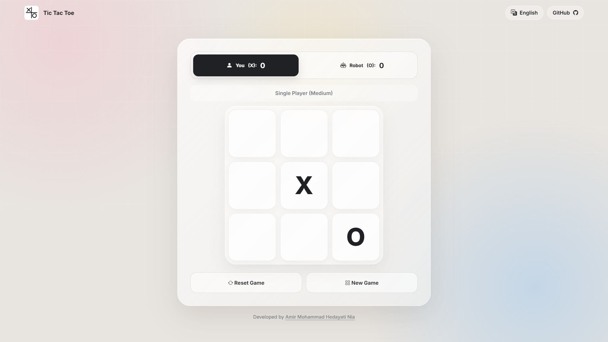
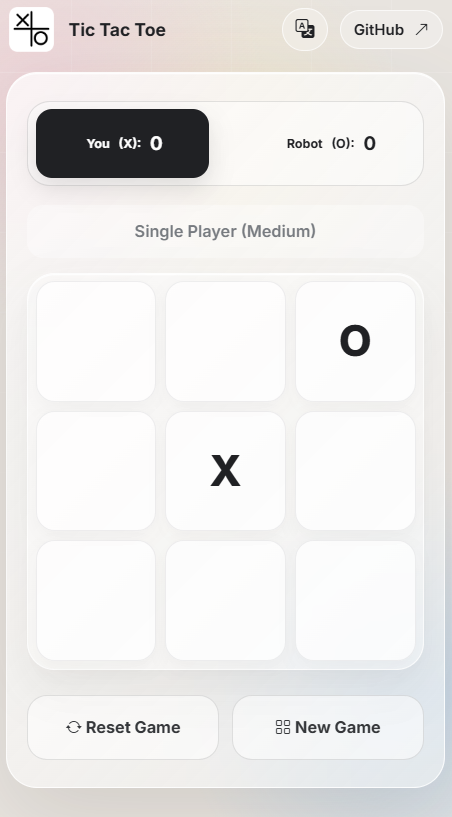

# 🎮 Tic-Tac-Toe Game — PWA

A modern, responsive, and installable **Tic-Tac-Toe game** built with **HTML, CSS, and JavaScript** and designed as a **Progressive Web App (PWA)**.

The game provides an interactive and user-friendly experience for playing Tic-Tac-Toe directly in the browser. It supports **Player vs Computer** and **Player vs Player on the same device**, with multiple difficulty levels for the computer opponent.

The application is completely **client-side** and does not require a server-side backend or online multiplayer system.

---
## 📱 Responsive Design
...
The goal is to keep the game board, controls, and menus accessible without unnecessary horizontal scrolling.

---

## 🌍 Supported Languages

| Language | Code | Direction |
|---|---|---|
| 🇬🇧 English | `en` | LTR |
| 🇮🇷 Persian | `fa` | RTL |
| 🇸🇦 Arabic | `ar` | RTL |
| 🇪🇸 Spanish | `es` | LTR |
| 🇫🇷 French | `fr` | LTR |

The application supports both left-to-right (LTR) and right-to-left (RTL) layouts.

- **English** — LTR
- **Persian** — RTL
- **Arabic** — RTL
- **Spanish** — LTR
- **French** — LTR

---

## ✨ Features

* 🎮 Interactive Tic-Tac-Toe gameplay
* 🤖 Player vs Computer
* 🧠 Multiple AI difficulty levels
* 👥 Player vs Player on the same device
* 🏆 Automatic win detection
* 🤝 Draw detection
* 🔄 Restart / New Game functionality
* 📱 Responsive design
* 💻 Desktop and mobile support
* ⚡ Progressive Web App (PWA)
* 📲 Installable on supported devices
* 📴 Offline gameplay
* 💾 Browser-based functionality
* 🎨 Modern and responsive user interface
* 🚫 No server-side backend required
* 🚫 No user account required
* 🚫 No online multiplayer

---

## 🎮 Game Modes

The game supports two main gameplay modes.

### 🤖 Player vs Computer

Play against a computer-controlled opponent.

The AI provides multiple difficulty levels to offer different gameplay experiences.

Depending on the selected difficulty, the computer can make easier or more challenging decisions.

### 👥 Player vs Player

Two players can play against each other **locally on the same device**.

> This mode does not provide online multiplayer functionality.

---

## 🧠 AI System

The computer opponent is implemented using **JavaScript game logic**.

The AI evaluates the available moves and selects a move based on the selected difficulty level.

The AI runs entirely inside the browser.

No external AI service, API, or server is required.

### Difficulty Levels

The project can provide different difficulty levels such as:

* 🟢 **Easy** — More relaxed gameplay
* 🟡 **Medium** — More balanced decision-making
* 🔴 **Hard** — More challenging gameplay

The exact AI behavior depends on the current implementation of the project.

---

## 🕹️ How to Play

The objective of Tic-Tac-Toe is to place three of your symbols in a row.

A winning combination can be:

* ➡️ Horizontal
* ⬇️ Vertical
* ↘️ Diagonal

For example:

```text
X | X | X
---------
O | O | X
---------
O | X | O
```

In this example, **X wins** because three X symbols are aligned horizontally.

If all cells are filled and neither player has three symbols in a row, the game ends in a **draw**.

---

## 📴 Offline Gameplay

The game is designed to work as a client-side application.

The main gameplay logic runs directly in the browser using JavaScript.

The project does not require an internet connection for normal gameplay after the required application resources are available locally or cached by the PWA.

The application does not depend on:

* ❌ Online game servers
* ❌ Real-time multiplayer servers
* ❌ User accounts
* ❌ Databases
* ❌ External APIs

---

## ⚡ Progressive Web App

This project is designed as a **Progressive Web App (PWA)**.

A PWA allows a web application to provide an app-like experience and, where supported, can be installed on a device.

The project uses:

* **Web App Manifest**
* **Service Worker**
* **Responsive Web Design**
* **Client-side JavaScript**

### 📲 Installing the App

On supported browsers:

1. Open the game website.
2. Open the browser menu.
3. Select **Install App** or **Add to Home Screen**.
4. Launch the game from the installed application.

PWA installation capabilities depend on the browser, operating system, and deployment environment.

---

## 📱 Responsive Design

The interface is designed to work across different screen sizes.

Supported layouts include:

* 💻 Desktop
* 🖥️ Large screens
* 💻 Laptop
* 📱 Mobile
* 📟 Tablet

The goal is to keep the game board, controls, and menus accessible without unnecessary horizontal scrolling.

---

## 🛠️ Technologies

The project is built using standard web technologies.

| Technology           | Purpose                               |
| -------------------- | ------------------------------------- |
| **HTML5**            | Application structure                 |
| **CSS3**             | Styling and responsive UI             |
| **JavaScript**       | Game logic and interaction            |
| **PWA**              | Installable web application           |
| **Web App Manifest** | Application metadata and installation |
| **Service Worker**   | Caching and offline functionality     |

## 🚀 Getting Started

### Prerequisites

No special development environment is required.

You only need:

* A modern web browser
* A local development server for testing PWA functionality

---

### 1. Clone the Repository

```bash
git clone https://github.com/HedayatiNiaDev/Tic-Tac-Toe-Game-PWA.git
```

---

### 2. Open the Project

Open the project folder in your preferred code editor.

For example:

```text
Tic-Tac-Toe-Game-PWA/
```

---

### 3. Run a Local Server

For normal HTML/CSS/JavaScript development, you can use a local development server.

If you are using **Visual Studio Code**, you can use the **Live Server** extension.

> Using a local server is recommended when testing PWA features such as the Service Worker.

---

### 4. Start Playing

Open the application in your browser.

Choose the desired game mode and difficulty level, then start playing.

---

## 🌐 Browser Support

The project is intended for modern browsers that support standard web technologies.

Recommended browsers include:

* Google Chrome
* Microsoft Edge
* Mozilla Firefox
* Safari

Some PWA features, especially installation and offline behavior, may vary depending on the browser and operating system.

---

## 🔒 Privacy

This application does not require users to create an account or provide personal information.

The game operates locally in the browser.

The project does not include:

* User authentication
* Online multiplayer
* Server-side game processing
* Personal user accounts
* A remote game database

Game interactions are handled on the client side.

---

## 🌐 Online Multiplayer

**Online multiplayer is not currently supported.**

The available Player vs Player mode is intended for two players using the **same device**.

There is currently no:

* Online matchmaking
* Multiplayer server
* Room system
* WebSocket connection
* Real-time remote gameplay

Online multiplayer may be considered as a future feature.

---

## 📸 Screenshots

### Main Menu


### Gameplay



### Mobile View




If the project contains screenshots, replace the example paths with the actual screenshot filenames.

---

## 🔮 Future Improvements

Possible future improvements include:

* 🌐 Online multiplayer
* 🏆 Leaderboard
* 👤 Player profiles
* 📊 Game statistics
* 🧠 Improved AI
* 🔊 Sound effects
* 🎨 Additional themes
* ✨ More animations
* ⚙️ Additional customization options
* 📴 Improved offline-first functionality
* 🌍 Online game rooms
* 🔗 Shareable game sessions

These features are potential future improvements and are **not currently part of the application** unless implemented.

---

## 🎯 Project Goals

The main goals of this project are:

* Practice HTML, CSS, and JavaScript
* Build an interactive browser game
* Implement game logic and state management
* Create a responsive user interface
* Learn and implement PWA concepts
* Provide an installable web application
* Practice client-side development

---

## 📌 Current Status

**Project Type:** Browser Game / PWA

**Current Gameplay:**

* ✅ Player vs Computer
* ✅ Player vs Player — Same Device
* ✅ AI Difficulty Levels
* ✅ Win / Loss / Draw Detection
* ✅ Responsive UI
* ✅ PWA
* ✅ Offline-oriented gameplay
* ❌ Online Multiplayer
* ❌ Online Matchmaking
* ❌ User Accounts
* ❌ Server-side Backend

---

## 👨‍💻 Author

**Amir Mohammad Hedayati Nia**

---

## ⭐ Support

If you found this project interesting or useful, consider giving the repository a ⭐ **Star** on GitHub.

---

### 🎮 About the Project

A simple and modern Tic-Tac-Toe game built with web technologies, featuring AI gameplay, local multiplayer, responsive design, and Progressive Web App capabilities.

**Play locally. Have fun. 🎮**
