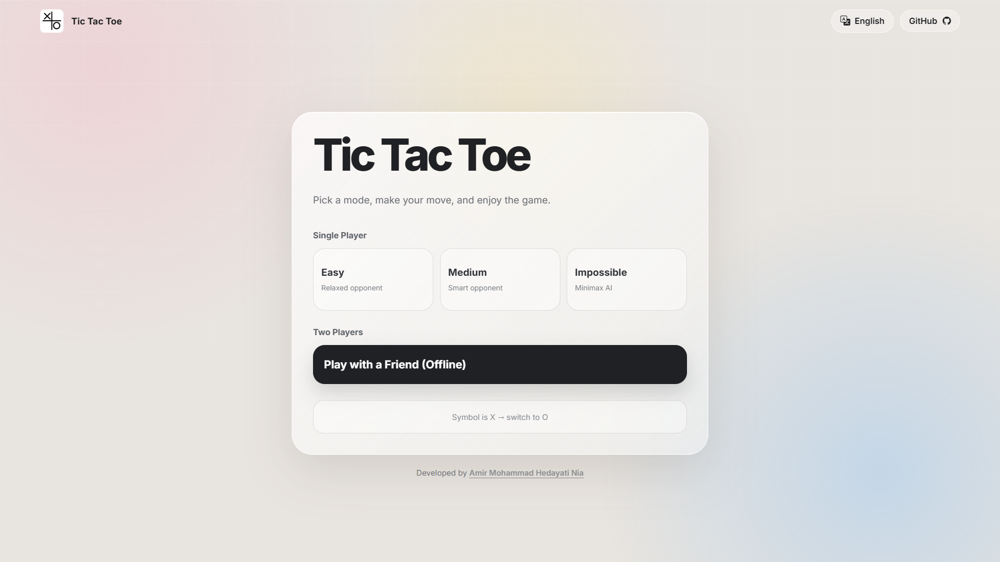
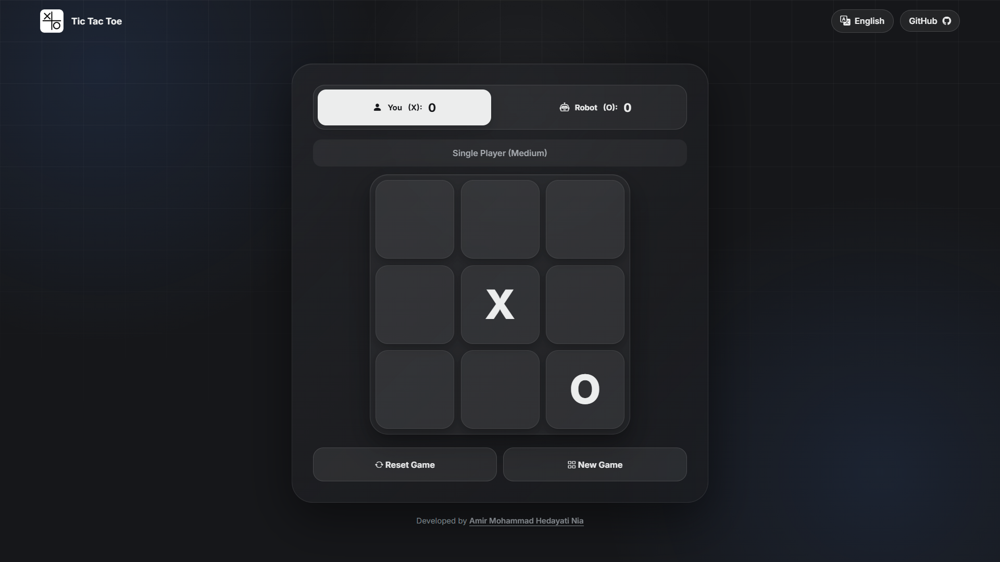
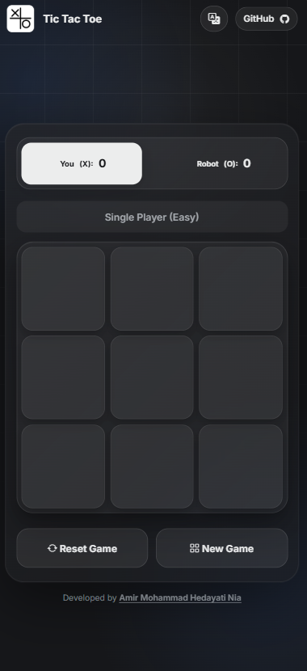

# 🎮 Tic Tac Toe (PWA)

A modern, responsive, installable **Tic Tac Toe Progressive Web App (PWA)** built with **HTML5, CSS3, and vanilla JavaScript**.

The game is fully client-side and supports **Single Player**, **Two Players on the same device**, multiple AI difficulty levels, multilingual UI, automatic dark mode, offline support, PWA installation, and in-app update detection.

---

## ✨ Features

- 🎮 Classic Tic Tac Toe gameplay
- 🤖 **Single Player** mode against the computer
- 👥 **Two Players** mode on the same device
- 🧠 Three AI difficulty levels:
  - 🟢 **Easy** — relaxed opponent
  - 🟡 **Medium** — smarter opponent
  - 🔴 **Impossible** — Minimax-based AI
- 🔄 Reset the current game or start a new game
- 🏆 Automatic win detection
- 🤝 Automatic draw detection
- 🔤 Choose your symbol (`X` or `O`) in Single Player mode
- 📊 Live score tracking during the current session
- ✏️ Editable player names in Two Players mode
- 🌍 Multilingual interface
- ↔️ Automatic LTR / RTL layout support
- 🌙 Automatic dark mode based on the system theme
- 📱 Responsive desktop, tablet, and mobile UI
- ⚡ Progressive Web App support
- 📲 Install directly from supported browsers
- 📴 Offline gameplay through a Service Worker
- 🔄 In-app notification when a new version is available
- ⬆️ Apply PWA updates without manually clearing the browser cache
- 🎨 Modern minimal interface
- 🚫 No account required
- 🚫 No backend required
- 🚫 No database required
- 🚫 No online multiplayer required

---


## 📸 Screenshots

### 🖥️ Main Menu


### 🖥️ Main Menu (Dark Mode)



### 🎮 Gameplay


### 🎮 Gameplay (Dark Mode)



### 📱 Mobile


### 📱 Mobile (Dark Mode)



## 🌍 Supported Languages

| Language | Code | Direction |
|---|---:|---|
| 🇬🇧 English | `en` | LTR |
| 🇮🇷 Persian | `fa` | RTL |
| 🇸🇦 Arabic | `ar` | RTL |
| 🇪🇸 Spanish | `es` | LTR |
| 🇫🇷 French | `fr` | LTR |

The interface automatically switches between **LTR** and **RTL** layouts where required.

---

## 🎮 Game Modes

### 🤖 Single Player

Play against the computer with three difficulty levels.

You can also choose whether to play as **X** or **O**. If you choose `O`, the computer starts the game as `X`.

### 👥 Two Players

Two people can play locally on the same device.

Player names can be edited directly in the scoreboard, making it easy to personalize a local match.

> Online multiplayer is not included.

---

## 🧠 AI

The AI is implemented entirely in JavaScript and does not use any external AI service.

### Easy

Uses a mixture of smart and random moves, making the computer less predictable while keeping the game relaxed.

### Medium

Uses smart tactical decisions most of the time, with occasional random moves for a more balanced experience.

### Impossible

Uses the **Minimax algorithm** to calculate the best available move.

The Impossible difficulty is designed to play optimally and should not be expected to make normal tactical mistakes.

---

## 🌙 Automatic Dark Mode

The application automatically follows the operating system or browser's preferred color scheme.

- ☀️ Light mode is used when the system prefers light mode.
- 🌙 Dark mode is used when the system prefers dark mode.
- 🔄 The interface updates automatically when the system theme changes.

No manual theme setting is required.

---

## ⚡ Progressive Web App

The project is a fully client-side **Progressive Web App**.

It includes:

- `manifest.json`
- `service-worker.js`
- Install prompt handling
- Offline app-shell caching
- PWA update detection
- In-app update action
- App icons
- Standalone display mode
- Mobile web-app metadata

### 📲 Install the App

On a supported browser:

1. Open the deployed game website.
2. Wait for the browser to recognize the application as installable.
3. Select **Install** when the install option is available.
4. Launch Tic Tac Toe as an installed application.

Installation support depends on the browser, operating system, HTTPS deployment, and PWA requirements.

---

## 🔄 PWA Updates

The application includes an update mechanism for the Service Worker.

When a newer version is detected:

1. The new Service Worker is installed in the background.
2. An **Update** button becomes available in the application.
3. Selecting **Update** activates the new Service Worker.
4. The application reloads automatically with the new version.

The Service Worker currently uses the cache version:

```text
tic-tac-toe-v2.1.1
```

When cached application files change, the cache version should be incremented in `service-worker.js` so existing installations can receive the updated app shell.

---

## 📴 Offline Support

After the application resources have been cached, the game can continue to work without an internet connection.

The Service Worker caches the main application resources, including:

- HTML
- CSS
- JavaScript
- Manifest
- App icons
- Favicon
- Required font/icon resources

Normal gameplay does not require:

- ❌ A game server
- ❌ A database
- ❌ An account
- ❌ An API
- ❌ An online multiplayer service

---

## 📱 Responsive Design

The interface is designed for:

- 💻 Desktop
- 🖥️ Large screens
- 💻 Laptop
- 📟 Tablet
- 📱 Mobile devices

The layout is designed to keep the main game experience accessible without unnecessary horizontal scrolling.

---

## 🛠️ Technologies

| Technology | Purpose |
|---|---|
| **HTML5** | Application structure |
| **CSS3** | UI, responsive layout, themes, and animations |
| **JavaScript** | Game logic and interaction |
| **Minimax** | Impossible AI |
| **PWA** | Installable web application |
| **Service Worker** | Offline caching and updates |
| **Web App Manifest** | Installation metadata |
| **Bootstrap Icons** | Local interface icons |
| **Inter** | Primary Latin font |
| **Vazirmatn** | Persian and Arabic typography |

The project does not require a JavaScript framework.

---

## 📁 Project Structure

```text
Tic-Tac-Toe-main/
├── assets/
│   └── bootstrap-icons/
├── css/
│   └── style.css
├── icons/
│   ├── icon-192.png
│   ├── icon-512.png
│   └── icon-maskable-512.png
├── js/
│   ├── i18n.js
│   ├── pwa.js
│   ├── script.js
│   └── theme.js
├── favicon.webp
├── index.html
├── manifest.json
├── service-worker.js
├── LICENSE
└── README.md
```

---

## 🚀 Getting Started

### Prerequisites

You only need:

- A modern web browser
- A local web server for development and PWA testing

No backend or package installation is required.

### 1. Clone the Repository

```bash
git clone https://github.com/HedayatiNiaDev/Tic-Tac-Toe-Game-PWA.git
```

### 2. Open the Project

```text
Tic-Tac-Toe-Game-PWA/
```

Open the project in your preferred code editor.

### 3. Run a Local Server

For example, with **Visual Studio Code**, you can use the **Live Server** extension.

A local HTTP server is recommended instead of opening `index.html` directly with `file://`, especially when testing:

- Service Worker
- PWA installation
- Offline caching
- PWA updates

### 4. Start Playing

Open the local or deployed website, select a game mode, choose the desired difficulty when playing against the computer, and start playing.

---

## 🌐 Browser Support

The application targets modern browsers supporting standard HTML, CSS, JavaScript, and PWA APIs.

Recommended browsers include:

- Google Chrome
- Microsoft Edge
- Mozilla Firefox
- Safari

PWA installation and some Service Worker capabilities can vary between browsers and operating systems.

---

## 🔒 Privacy

The game is designed to run locally in the browser.

It does not require:

- User registration
- Authentication
- Personal profiles
- A remote game database
- Server-side game processing
- Online multiplayer infrastructure

Gameplay logic runs on the client.

---

## 🌐 Online Multiplayer

**Online multiplayer is not currently supported.**

The Two Players mode is designed for local play on the same device.

There is currently no:

- ❌ Online matchmaking
- ❌ Multiplayer server
- ❌ Room system
- ❌ WebSocket gameplay
- ❌ Real-time remote multiplayer
- ❌ User account system

---

## 🔮 Possible Future Improvements

Potential future features include:

- 🌐 Online multiplayer
- 🏆 Global leaderboard
- 📊 Extended statistics
- 💾 Persistent game history
- 🔊 Sound effects
- 🎨 Additional themes
- ✨ More visual animations
- ⚙️ Additional gameplay customization
- 🔗 Shareable game sessions
- 🌍 Online game rooms

These are future ideas and are not part of the current implementation unless explicitly added to the project.

---

## 🎯 Project Goals

This project focuses on:

- Learning and practicing HTML, CSS, and JavaScript
- Building a polished browser game
- Implementing game state and win detection
- Creating a responsive user interface
- Implementing AI decision-making
- Understanding the Minimax algorithm
- Learning Progressive Web App concepts
- Supporting offline-first gameplay
- Implementing Service Worker update handling
- Building a multilingual web application

---

## 📌 Current Status

| Feature | Status |
|---|:---:|
| Player vs Computer | ✅ |
| Player vs Player — Same Device | ✅ |
| Easy AI | ✅ |
| Medium AI | ✅ |
| Impossible / Minimax AI | ✅ |
| X / O Selection | ✅ |
| Score Tracking | ✅ |
| Editable Player Names | ✅ |
| Win Detection | ✅ |
| Draw Detection | ✅ |
| Multilingual UI | ✅ |
| RTL Support | ✅ |
| Automatic Dark Mode | ✅ |
| Responsive UI | ✅ |
| PWA | ✅ |
| PWA Installation | ✅ |
| Offline Gameplay | ✅ |
| PWA Update Detection | ✅ |
| In-App PWA Update | ✅ |
| Online Multiplayer | ❌ |
| Online Matchmaking | ❌ |
| User Accounts | ❌ |
| Server-side Backend | ❌ |

---

## 👨‍💻 Author

**Amir Mohammad Hedayati Nia**

GitHub:  
https://github.com/HedayatiNiaDev

---

## ⭐ Support

If you like the project, consider giving the repository a ⭐ **Star** on GitHub.

---

## 🎮 About

A clean and modern Tic Tac Toe PWA built with vanilla web technologies, featuring local multiplayer, AI opponents, Minimax gameplay, multilingual support, automatic dark mode, offline functionality, installation support, and seamless PWA updates.

**Play locally. Install it. Play offline. Have fun. 🎮**
